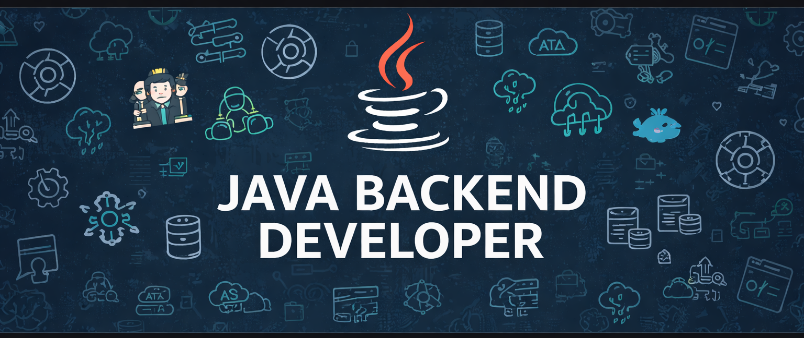

  

<h1 align="center">Hi 👋, I'm Rajan Kumar</h1>
<h3 align="center">Senior Java Backend Developer | Microservices | Cloud & DevOps</h3>

  A passionate backend engineer from India 🇮🇳 building scalable, secure, and production-ready systems

---

 
<!--  -->

## 🧑‍💻 About Me
- 💼 **4+ years** of experience in **Java Backend Development**
- ☕ Strong expertise in **Java 8 (Streams, Lambda, Optional)**
- 🧩 Microservices & REST API specialist
- ☁️ Cloud-native developer with **AWS & Kubernetes**
- 🔁 CI/CD automation using **Jenkins**
- 🧠 Clean code, performance & scalability focused

---

## 🛠️ Tech Stack

### 🔹 Backend
- **Language:** Java 8  
- **Frameworks:** Spring Boot, Spring MVC, Spring Data JPA, Spring Security  
- **Architecture:** Microservices, RESTful APIs  
- **Concepts:** OOPs, SOLID, Design Patterns, Exception Handling  

---

### 🔹 Databases
- **SQL:** MySQL, PostgreSQL  
- **NoSQL:** MongoDB  
- **ORM:** Hibernate / JPA  
- **Skills:** Query Optimization, Indexing, Transactions  

---

### 🔹 DevOps & Cloud
- **CI/CD:** Jenkins, GitHub Actions  
- **Cloud:** AWS (EC2, S3, RDS, IAM)  
- **Containers:** Docker  
- **Orchestration:** Kubernetes  
- **Build Tool:** Maven  
- **Version Control:** Git  

---

### 🔹 Other Skills
- Multithreading & Concurrency  
- Secure API Development  
- Logging & Monitoring  
- Performance Tuning  
- Linux Basics  

---

## 💼 Professional Experience
### 🔸 Senior Java Backend Developer
**4+ Years | Enterprise Applications**

- Designed & developed scalable REST APIs
- Built microservices using Spring Boot & Java 8
- Implemented role-based authentication & authorization
- Improved performance via query optimization
- Built CI/CD pipelines with Jenkins
- Deployed applications on AWS & Kubernetes
- Collaborated with cross-functional teams

---

## 📌 Featured Projects

### 🔹 Order Management Microservice
**Java 8 | Spring Boot | Microservices | MySQL | Docker**
- Scalable microservice architecture
- Pagination, filtering & sorting
- Centralized logging & exception handling

---

### 🔹 Employee Management System
**Java | Spring MVC | JDBC | MySQL**
- CRUD APIs with validation
- Secure backend design
- Clean layered architecture

---

### 🔹 User Management System
**Spring Boot | Spring Security | MongoDB**
- JWT-based authentication
- Role-based access control
- Modular & secure backend

---

## 📈 GitHub Stats
<!-- 

  
  [Rajan kumar GitHub stats](https://github-readme-stats.vercel.app/api?username=Rajan9865&commits_year=2025)

 -->

---

## 📫 Connect With Me
- 💼 LinkedIn: https://www.linkedin.com/in/rajan-kumar-78800/
- 📧 Email: rajan06166@gmail.com 
- 🌍 GitHub: https://github.com/Rajan9865 

---

## ⚡ Quote
> *"Clean code and scalable architecture are the foundation of great software."*
