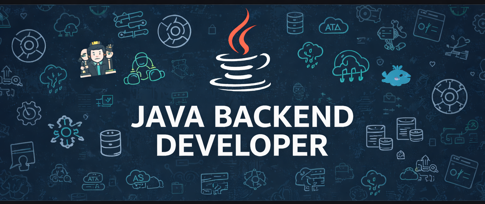

  

<h1 align="center">Hi 👋, I'm Rajan Kumar</h1>
<h3 align="center">Senior Java Backend Developer | Microservices | Cloud & DevOps</h3>

  A passionate backend engineer from India 🇮🇳 building scalable, secure, and production-ready systems

---

 
<!--  -->

## 🧑‍💻 About Me
  Senior Backend Software Engineer with **4+ years of experience** in **Java and Spring Boot**,
  specializing in **microservices, REST APIs, and scalable backend systems**.
  Currently at **Inventia Technologies**, previously with **FCI-CCM**.
- ☕ Strong expertise in **Java 8 (Streams, Lambda, Optional)**
- 🧩 Microservices & REST API specialist
- ☁️ Cloud-native developer with **AWS & Kubernetes**
- 🔁 CI/CD automation using **Jenkins**
- 🧠 Clean code, performance & scalability focused

---

## 🛠️ Tech Stack

### 🔹 Backend
- **Language:** Java 8  
- **Frameworks:** Spring Boot, Spring MVC, Spring Data JPA, Spring Security  
- **Architecture:** Microservices, RESTful APIs  
- **Concepts:** OOPs, SOLID, Design Patterns, Exception Handling  

---

### 🔹 Databases
- **SQL:** MySQL, PostgreSQL  
- **NoSQL:** MongoDB  
- **ORM:** Hibernate / JPA  
- **Skills:** Query Optimization, Indexing, Transactions  

---

### 🔹 DevOps & Cloud
- **CI/CD:** Jenkins, GitHub Actions  
- **Cloud:** AWS (EC2, S3, RDS, IAM)  
- **Containers:** Docker  
- **Orchestration:** Kubernetes  
- **Build Tool:** Maven  
- **Version Control:** Git  

---

### 🔹 Other Skills
- Multithreading & Concurrency  
- Secure API Development  
- Logging & Monitoring  
- Performance Tuning  
- Linux Basics  

---

## 💼 Professional Experience

### 🔸 Senior Software Engineer- Java  
**Inventia Technologies** | Noida, India  
*June 2025 – Present*

- Led the design and development of scalable backend systems using **Java 8 and Spring Boot** for enterprise-grade applications.
- Architected and implemented **RESTful microservices** with clean, modular, and maintainable design.
- Developed and optimized high-performance APIs, improving response times through query optimization and efficient data access.
- Implemented secure authentication and authorization using **Spring Security (JWT, Role-Based Access Control)**.
- Designed and optimized database schemas and queries using **MySQL/PostgreSQL**.
- Built and maintained **CI/CD pipelines** using **Jenkins and GitHub Actions**.
- Deployed and monitored applications on **AWS (EC2, S3, RDS)** and **Docker/Kubernetes** environments.
- Collaborated with frontend, QA, DevOps, and product teams to deliver features from design to production.
- Conducted code reviews and mentored junior developers to maintain high code quality.

---

### 🔸 Software Engineer (Java Backend)  
**FCI-CCM**  
*September 2022 – June 2025*

- Developed and maintained backend modules using **Core Java and Spring Boot** for enterprise systems.
- Built and integrated **REST APIs** to support internal and external application workflows.
- Worked extensively with **MySQL** for CRUD operations, indexing, and query optimization.
- Diagnosed and resolved production issues, improving application stability and performance.
- Followed clean code principles and best practices in backend development.
- Strengthened foundations in **object-oriented design, backend architecture, and API development**.

## 📌 Featured Projects

### 🔹 Order Management Microservice
**Java 8 | Spring Boot | Microservices | MySQL | Docker**
- Scalable microservice architecture
- Pagination, filtering & sorting
- Centralized logging & exception handling

---

### 🔹 Employee Management System
**Java | Spring MVC | JDBC | MySQL**
- CRUD APIs with validation
- Secure backend design
- Clean layered architecture

---

### 🔹 User Management System
**Spring Boot | Spring Security | MongoDB**
- JWT-based authentication
- Role-based access control
- Modular & secure backend

---

## 📈 GitHub Stats
<!-- 

  
  [Rajan kumar GitHub stats](https://github-readme-stats.vercel.app/api?username=Rajan9865&commits_year=2025)

 -->

---

## 📫 Connect With Me
<a href="https://www.linkedin.com/in/rajan-kumar-78800/" target="_blank">LinkedIn</a>
<a href="mailto:rajan06166@gmail.com" target="_blank">Email</a>
<a href="https://github.com/Rajan9865" target="_blank">GitHub</a>

---

## ⚡ Quote
> *"Clean code and scalable architecture are the foundation of great software."*
